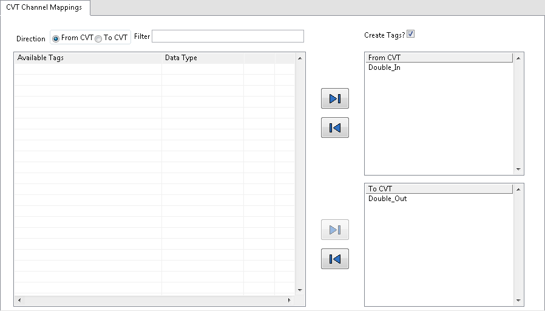

# Overview

The Current Value Table (CVT) module allows for storing and managing data in a single location, enabling users to share data between DCAF engines or between a DCAF engine and any parallel LabVIEW code using the [CVT Library](https://forums.ni.com/t5/Reference-Design-Content/LabVIEW-Current-Value-Table-CVT-Library/ta-p/3514251). The module also serves as a convenient mechanism to debug DCAF applications by providing easy access to selected tags.

# Using the CVT Module

### Between DCAF and Other LabVIEW Code

Any CVT tags accessed by the DCAF CVT module can also be accessed on the same target using the CVT API which can be found in the palettes at Functions>>Addons>>Current Value Table. The tag in the Current Value Table will have the same name as the tag used in the DCAF module configuration.

For more comprehensive documentation on using the CVT API, refer to the [LabVIEW Current Value Table Library](http://forums.ni.com/t5/Reference-Design-Content/LabVIEW-Current-Value-Table-CVT-Library/ta-p/3514251).

### Between Multiple DCAF Engines

To share data between DCAF engines running on the same target, the tag names and data types written to and read from the Current Value Table in each engine must match.

**Note:** The CVT may be accessed within modules, but should not be used as an alternative to the DCAF tag bus.

# Configuration

**Direction:** Choose whether you are configuring tags to be written to the CVT or configuring tags to be read from from the CVT. If *From CVT* is selected you will only be able to move tags into the *From CVT* listbox. Conversely, if *To CVT* is selected you will only be able to move tags into the *To CVT* listbox. The direction selected will also effect the visible items in *Available Tags*.

**Filter:** Filter tags displayed in *Available Tags*, *From CVT*, and *To CVT* lists using the LabVIEW [Match Pattern](http://zone.ni.com/reference/en-XX/help/371361L-01/glang/match_pattern/) primitive.

**Create Tags?:** When the CVT module initializes during runtime it will attempt to look up the indices of all tags configured to be written to or read from the Current Value Table. If *Create Tags?* is selected, the module will create any tags which it is not able to find, otherwise the module will fail to initialize.

**Available Tags:** A list of tags which can be added to the *From CVT* or *To CVT* listboxes (depending on the selected direction).

**From CVT:** List of tags which will be read from the CVT and put onto the engine's Tag Bus. Remove items from this list by selecting a tag from the *From CVT* listbox and clicking the left arrow. Add items to the list by selecting a tag from the *Available Tags* listbox and clicking the right arrow.

**To CVT:** List of tags which will be read from the engine's Tag Bus and written to the CVT. Remove items from this list by selecting a tag from the *To CVT* listbox and clicking the left arrow. Add items to the list by selecting a tag from the *Available Tags* listbox and clicking the right arrow.

# Software Requirements

+   LabVIEW 2014 or later
+   NI Current Value Table 3.3.0.13 or later
